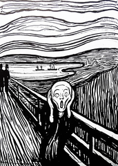
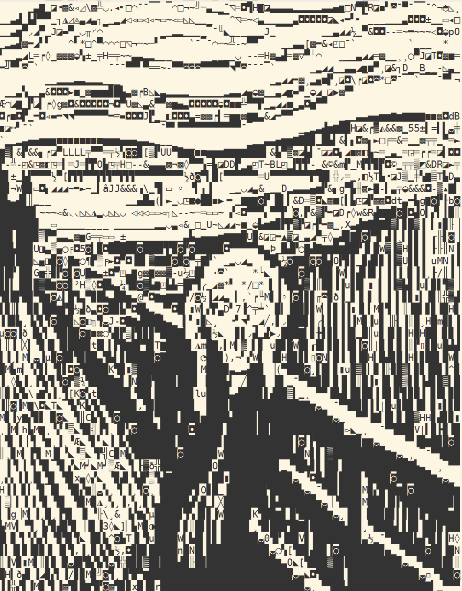
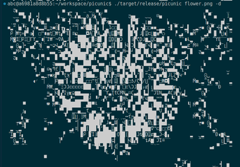

# picunic

A terminal image viewer that renders images using Unicode characters. Uses a CNN to match image regions to visually similar Unicode glyphs.

| Input | Output |
|-------|--------|
|  |  |
|  |  |

## Installation

```bash
cargo build --release
```

## Usage

### picunic - view images in terminal

```bash
picunic image.png              # 80 chars wide
picunic image.png -w 120       # custom width
picunic image.png -i           # invert colors (for light terminals)
picunic image.png -d           # enable dithering for photos
picunic image.png -a           # ASCII only output
```

### bigfoont - render text as large Unicode art

```bash
bigfoont "HELLO"                                       # default 2×2 chars per letter
bigfoont "HELLO" -w 4 -H 4                             # 4×4 chars per letter
bigfoont "HELLO" -f assets/PressStart2P.ttf            # use pixel font
bigfoont "HELLO" -a                                    # ASCII output only
```

## How it works

1. Splits input image into 8×16 pixel chunks (matching terminal cell aspect ratio)
2. Runs each chunk through a CNN encoder to get a 64-dim embedding
3. Finds the Unicode character with the most similar embedding (cosine similarity)
4. Outputs the best matching character for each chunk

The CNN is trained on ~2000 Unicode characters rendered in a monospace font, learning to map visual patterns to character embeddings.

## Training

To retrain the model with a different font:

```bash
cd training
pip install -r requirements.txt

python train.py --font ../assets/DejaVuSansMono.ttf --epochs 50
python export.py --checkpoint checkpoints/best.pt \
    --output ../assets/encoder \
    --font ../assets/DejaVuSansMono.ttf
```

## Web Version

Picunic can also run in the browser as a WebAssembly application. See [WASM_BUILD.md](WASM_BUILD.md) for build instructions.

## Examples

```bash
# View a photo with dithering
picunic flower.png -w 100 -d -i

# View line art (no dithering needed)
picunic line-art.png -w 80

# Generate ASCII art text banner
bigfoont "Hello World" -w 6 -H 3
```
